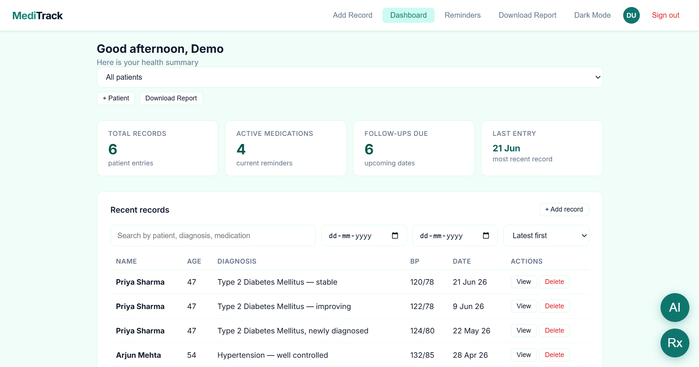
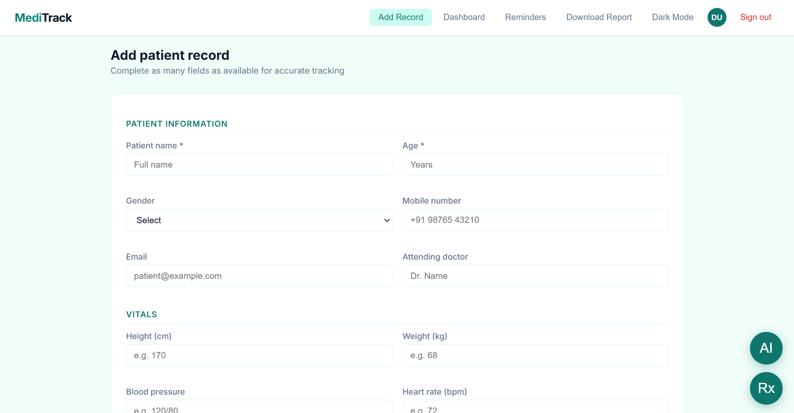

# MediTrack — Personal Health Dashboard

> A client-side health record and medication tracker built for patients managing chronic conditions — inspired by biotech domain knowledge, designed for longitudinal care.

**Live demo:** [sss2406.github.io/MediTrack](https://sss2406.github.io/MediTrack/) — click **"View live demo"** on the sign-in screen to load a pre-populated workspace instantly, no account required.

---

##  Screenshots

> Replace these placeholders with real screenshots — drop image files into a `/screenshots` folder and update the paths below.

| Dashboard | Add Record | Reminders |
|---|---|---|
|  |  |  |

---

##  Features

- **Authentication** — Sign up / sign in flow backed by `localStorage`, plus a one-click **instant demo login** that seeds realistic sample data (no signup needed).
- **Patient records** — Add, view, search, filter (by date range and keyword), sort, and delete structured health records: vitals, symptoms, diagnosis, prescribed medications, and free-text notes.
- **Multi-patient support** — Switch between patient profiles from a single dashboard, with per-patient filtering across records and charts.
- **Health visualizations** — Chart.js line chart tracking systolic BP / weight / heart rate over time, and a doughnut chart of prescribed medication frequency.
- **Medication reminders** — Add dosage + time + frequency reminders, with simulated push notifications (and real `Notification` API integration where supported by the browser).
- **AI-style assistant (local, offline)** — A lightweight rule-based chat panel that summarizes records and flags missing vitals — entirely client-side, no data leaves the browser.
- **Drug interaction checker (demo)** — A small built-in ruleset that flags common interaction pairs (e.g. warfarin + aspirin) for illustrative purposes.
- **PDF export** — One-click patient report generation via jsPDF.
- **File attachments** — Reports / lab results / X-rays attached to a record are persisted locally via IndexedDB.
- **Dark mode**, fully responsive layout, and a installable PWA manifest + service worker.
- **Skeleton loading states** on the dashboard and reminders list for a production-grade feel on every navigation.
- **Polish pass** — cohesive teal/blue color system, gradient accents, micro-interactions on hover/press, staggered entrance animations, and `prefers-reduced-motion` support for accessibility.

---

## Tech stack

| Layer | Choice |
|---|---|
| Markup / styling | HTML5, CSS3 (custom properties, CSS Grid/Flexbox, keyframe animations) |
| Logic | Vanilla JavaScript (ES6+) — no framework, no build step |
| Charts | [Chart.js](https://www.chartjs.org/) |
| PDF export | [jsPDF](https://github.com/parallax/jsPDF) |
| Local persistence | `localStorage` (records, reminders, sessions) + `IndexedDB` (file attachments) |
| Offline / installability | Web App Manifest + Service Worker (PWA) |
| Hosting | GitHub Pages |

## Why no backend (and when I'd add one)

MediTrack intentionally runs entirely client-side. For a personal-use health tracker, keeping data on-device by default is a defensible privacy posture, and it means the live demo works instantly with zero infrastructure cost or signup friction for a recruiter or reviewer.

That said, a real multi-device product would need a backend. The natural next step is **Firebase**:
- **Firebase Authentication** to replace the `localStorage`-based login.
- **Cloud Firestore** to sync records/reminders across devices in real time, with security rules scoping each patient's data to their own account.
- **Firebase Cloud Messaging** to replace the simulated push notifications with real ones.
- **Firebase Hosting** as a drop-in alternative to GitHub Pages.

This is a straightforward swap of the `loadUserData` / `saveUserData` / `doLogin` functions for Firebase SDK calls — happy to wire this up as a v2 if the project needs real persistence.

---

##  Getting started

No build tools, no dependencies to install.

```bash
git clone https://github.com/sss2406/MediTrack.git
cd MediTrack
# open index.html directly, or serve it locally:
python3 -m http.server 8080
```

Then visit `http://localhost:8080` and click **View live demo**.

### Demo credentials
```
Email:    demo@meditrack.com
Password: demo1234
```

---

##  Project structure

```
MediTrack/
├── index.html          # Entire app — markup, styles, and logic
├── manifest.json        # PWA manifest
├── service-worker.js     # Offline caching
└── screenshots/          # README images
```

---

## The case study angle

> Built for patients managing chronic conditions — inspired by biotech domain knowledge.

The demo data models two realistic chronic-care journeys (newly-diagnosed hypertension and Type 2 diabetes) across multiple visits, so the vitals chart tells an actual clinical story — gradually improving blood pressure, weight, and glucose control — rather than showing disconnected, random numbers. That's the detail worth mentioning in an interview: the sample data isn't filler, it's a small case study in longitudinal chronic-disease tracking.

---

##  Roadmap

- [ ] Firebase Auth + Firestore sync across devices
- [ ] Real push notifications via FCM
- [ ] Role-based views for caregivers / clinicians
- [ ] CSV export alongside PDF
- [ ] Unit tests for the filtering/sorting logic

---

##  Author

**Sri Sudharshana S**
Developed and deployed independently as a portfolio project.

## License

MIT — feel free to fork and adapt.
